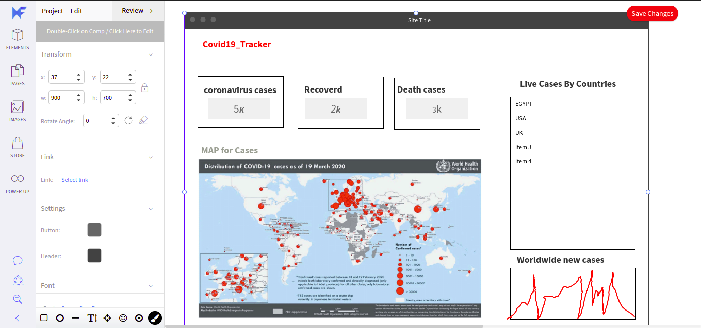

<!-- @format -->

<span style="color:red">
<h1>Covid-19-tracker</h1>
</span>

<p align="center">
  
</p>

Visit the App Here [Covid**19**Tracker](https://covid19-tracker-e4259.web.app/)

<span style="color:green">
<h1>Shows</h1>
</span>

> Cases

1. coronavirus cases
2. Recoverd cases
3. Death cases

> Map
> that show marks like google map marks showing the cases in specific countries

> Live Cases By Countries

> Live world wide new cases

<span style="color:green">
<h1>Apis used </h1>
</span>

1. [disease.sh - Open Disease Data]
2. leaflet [ https://leafletjs.com/]an open-source JavaScript library for mobile-friendly interactive maps

<span style="color:green">
<h1>Deployment </h1>
</span>

- [x] Wireframe of the project
- [x] set up (create react app )
- [x] cleanup the project
- [x] Firebase App ( )
- [x] structure of covide Tracker [coding structures and specifying the component and where to go from one component the the other
- [x] Create the Header
- [x] create the info boxes
- [x] Table Show all countries and corona total corona cases in it
- [x] Line Graph to show the cases as chart
- [x] Create Map
- [x] Styling [Material UI]
- [x] Deploy

<span style="color:#e84545">
<h2> Scenario </h1>
</span>

The user will select worldwide or <span style="color:#387c6d">Other country</span>

1. First scenario (worldwide) the app will call the api (disease.sh)

> Request :

    `https://disease.sh/v3/covid-19/all`

> Response :

`{ "updated": 1616252972727, "cases": 123074456, "todayCases": 194134, "deaths": 2715915, "todayDeaths": 2925, "recovered": 99175869, "todayRecovered": 121223, "active": 21182672, "critical": 89579, "casesPerOneMillion": 15789, "deathsPerOneMillion": 348.4, "tests": 1786406484, "testsPerOneMillion": 228637.83, "population": 7813258510, "oneCasePerPeople": 0, "oneDeathPerPeople": 0, "oneTestPerPeople": 0, "activePerOneMillion": 2711.12, "recoveredPerOneMillion": 12693.28, "criticalPerOneMillion": 11.46, "affectedCountries": 221 }`

2. Second scenario (e.g EGYPT) the app will call the api (disease.sh)

> Request :

    `https://disease.sh/v3/covid-19/countries/egypt?strict=true`

> Response :

     {
      "updated": 1616267975422,
      "country": "Egypt",
      "countryInfo": {
        "_id": 818,
        "iso2": "EG",
        "iso3": "EGY",
        "lat": 27,
        "long": 30,
        "flag": "https://disease.sh/assets/img/flags/eg.png"
      },
      "cases": 194127,
      "todayCases": 0,
      "deaths": 11512,
      "todayDeaths": 0,
      "recovered": 149256,
      "todayRecovered": 0,
      "active": 33359,
      "critical": 90,
      "casesPerOneMillion": 1872,
      "deathsPerOneMillion": 111,
      "tests": 1000000,
      "testsPerOneMillion": 9643,
      "population": 103704867,
      "continent": "Africa",
      "oneCasePerPeople": 534,
      "oneDeathPerPeople": 9008,
      "oneTestPerPeople": 104,
      "activePerOneMillion": 321.67,
      "recoveredPerOneMillion": 1439.24,
      "criticalPerOneMillion": 0.87
    }

3. After all of this : i get all these infos and pass it to my components [infoBoxes] to update the app

<span style="color:#ffea00">
<h1>Some Details </h1>
</span>

- Wireframe

<p align="center">
  
</p>

<span style="color:#ffea00">
<h1>Technologies && Libraries </h1>
</span>
- firebase
- MaterialUiIcons
- React-router
- Link so no need to refresh the page when use hyperlink

## Available Scripts

In the project directory, you can run:

### `npm start`

Runs the app in the development mode.\
Open [http://localhost:3000](http://localhost:3000) to view it in the browser.

The page will reload if you make edits.\
You will also see any lint errors in the console.

```

```
